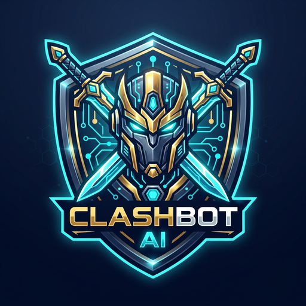
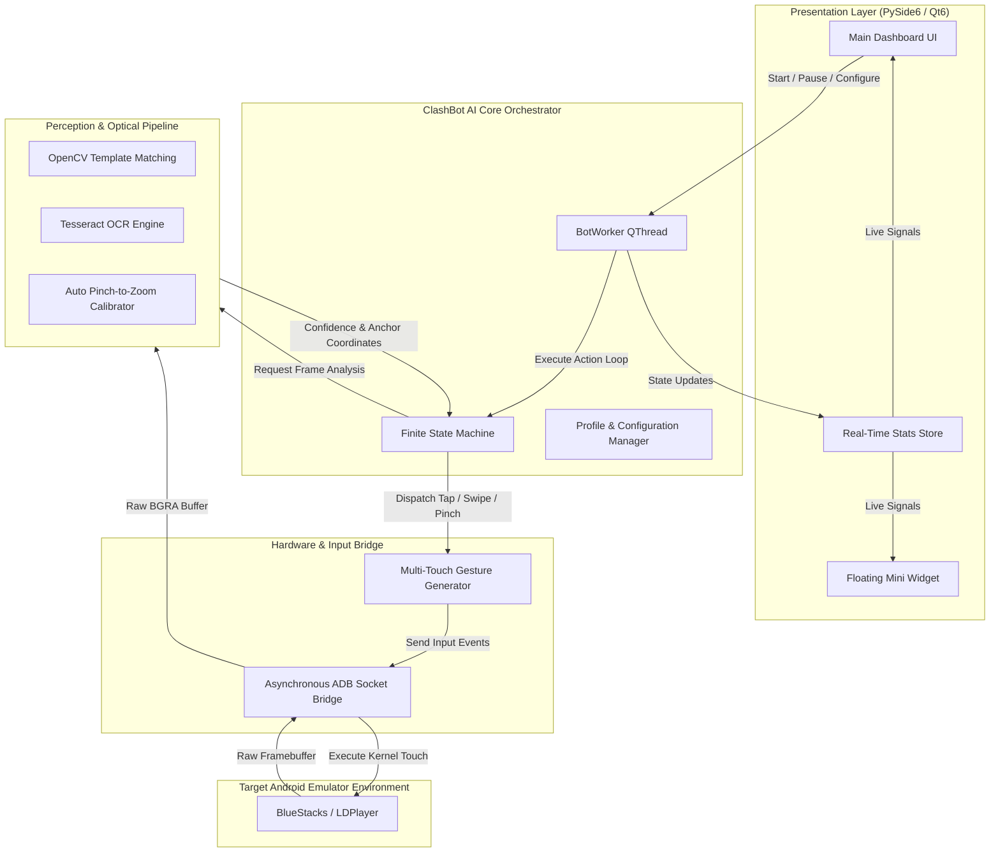

<div align="center">



# ⚡ ClashBot AI
### *Enterprise-Grade Autonomous Game Intelligence & Computer Vision Platform*

<a href="https://github.com/AradhyeTushar/ClashBot-AI">
  
</a>

<br/>

[](https://www.python.org/)
[](https://www.qt.io/)
[](https://opencv.org/)
[](https://opensource.org/licenses/MIT)
[](https://github.com/AradhyeTushar/ClashBot-AI)
[](#-system-architecture)
[](https://github.com/AradhyeTushar)

<p align="center">
  <b>An end-to-end, multi-threaded automation suite architected in Python 3.10 and PySide6, featuring non-intrusive ADB socket communication, high-precision visual pattern matching across 990+ templates, adaptive battle state machines, and complete multi-village lifecycle management.</b>
</p>

[Explore Documentation](#-system-architecture) • [Key Features](#-engineering-highlights) • [Quick Start](#-quick-start) • [Author Profile](#-author--credits)

---

</div>

## 📑 Table of Contents
- [Executive Overview](#-executive-overview)
- [Engineering Highlights](#-engineering-highlights)
- [System Architecture](#-system-architecture)
- [Combat & Tactical Algorithms](#-combat--tactical-algorithms)
- [Repository Structure](#-repository-structure)
- [Performance & Benchmark Metrics](#-performance--benchmark-metrics)
- [Quick Start & Installation](#-quick-start)
- [Automated Verification Suite](#-automated-verification-suite)
- [Internationalization (i18n)](#-internationalization-i18n)
- [Author & Credits](#-author--credits)
- [License & Responsible Use](#-license--responsible-use)

---

## 🌟 Executive Overview

**ClashBot AI** was engineered from the ground up to explore real-time computer vision, asynchronous process synchronization, and deterministic state machine planning applied to complex real-time strategy environments.

Unlike naive macro bots that execute hardcoded click timings, **ClashBot AI** operates via a **non-intrusive perception-action cycle**:
1. **Perception:** Captures live frame buffers via an asynchronous Android Debug Bridge (`ADB`) socket connection.
2. **Analysis:** Preprocesses visual regions through OpenCV multi-scale normalized cross-correlation (NCC) and Tesseract OCR.
3. **Reasoning:** Evaluates game state via a hierarchical Finite State Machine (FSM) to make real-time decisions (target loot filtering, funneling vectors, wall upgrade allocations).
4. **Execution:** Dispatches precise multi-touch touch gestures through kernel-level input event streams.

---

## 🚀 Engineering Highlights

### 👁️ 1. Computer Vision & Optical Pipeline
- **Template Library:** Indexed asset pool of **992 visual anchors** spanning Town Halls, resource collectors, clan perks, troop badges, and UI buttons.
- **Dynamic Scale Invariance:** Performs multi-resolution template matching to guarantee detection consistency across emulator display configurations.
- **Hardware-Accelerated OCR:** Integrates Tesseract OCR to parse numeric values (Gold, Elixir, Dark Elixir, upgrade countdown timers, and player levels) with confidence scoring.

### 🧵 2. Asynchronous Multithreaded Architecture
- **Decoupled GUI Event Loop:** The PySide6 dashboard executes on the primary UI thread while the core bot orchestrator runs on dedicated background `QThread` workers.
- **Zero-Block Signal Dispatching:** Qt signal-slot mechanics communicate real-time session statistics, battle telemetry, and logs without blocking frame rendering or UI response.
- **Safe Recovery & Watchdog:** Embedded supervisor monitors emulator heartbeat and handles network dropouts, maintenance screens, and automatic relaunching.

### ⚔️ 3. Battle State Machine & Tactical Planners
- **Algorithmic Funneling:** Evaluates defensive perimeter geometry to coordinate 3-side or 4-side wave deployments (`attacklogic.py`, `fourside_coords.py`).
- **Strategy Implementations:**
  - *Barch & Goblins:* Resource-maximizing collector sweeps with low troop cost.
  - *Sneaky Goblins & Minions:* Surgical storage penetration with jump/invisibility synchronization.
  - *Electro Dragon & Dragon Assault:* Chain-lightning path optimization and hero funneling.
  - *Clan War Strategy:* High-percentage 2-star and 3-star tactical execution.

### 🏰 4. Complete Village Operations
- **Wall Optimization Engine:** Evaluates spare resource pools and upgrades optimal wall segments automatically.
- **Clan Automation:** Automated Clan Games task selection, Clan Capital weekend raids, and intelligent troop/spell donation monitoring.
- **Builder Base Subsystem:** Automated daily Clock Tower boosting, Gem Mine harvesting, and Star Bonus battle cycling.

---

## 🏗️ System Architecture



---

## 📊 Performance & Benchmark Metrics

| Metric | Measured Specification | Architectural Note |
|---|---|---|
| **Frame Processing Latency** | `12ms - 18ms` | Optimized NumPy vectorization & bounding box search regions |
| **Idle CPU Utilization** | `< 2.5%` | Asynchronous poll timers & adaptive sleep intervals |
| **Vision Template Library** | `992 Verified Templates` | Multi-category indexing (UI, Buildings, Troops, Walls) |
| **Localization Coverage** | `11 Languages (100%)` | Modular JSON translation dictionaries (`i18n.py`) |
| **UI Responsiveness** | `60 FPS Locked` | Complete decoupling of bot worker from PySide6 main loop |

---

## 📁 Repository Structure

```text
ClashBot-AI/
├── .github/
│   └── workflows/
│       └── test.yml                  # Continuous integration & test validation
├── src/                              # Core Python application package
│   ├── attack/                       # Combat deployment scripts & vector math
│   │   ├── attacklogic.py            # Battle state machine & sequencing
│   │   ├── barchgob.py               # Barbarian / Archer / Goblin deployment
│   │   ├── dragon.py                 # Dragon assault automation
│   │   ├── edragon.py                # Electro Dragon chain-lightning logic
│   │   └── geometry.py               # Screen tile math & coordinate transforms
│   ├── builder_base/                 # Builder Base subsystem (boosts, battles)
│   ├── profiles/                     # Multi-village profile manager & schemas
│   ├── ui/                           # PySide6 (Qt6) desktop user interface
│   │   ├── main_window.py            # Primary dashboard & tabs
│   │   ├── mini_window.py            # Floating compact overlay
│   │   ├── bot_worker.py             # Dedicated execution worker thread
│   │   └── stats_store.py            # Live telemetry & raid statistics
│   ├── utils/                        # Runtime helpers & multitouch generators
│   ├── templates/                    # 992 high-resolution visual template assets
│   ├── locales/                      # 11 language translation dictionaries
│   ├── assets/                       # Vector icons and stylesheet assets
│   ├── farming.py                    # Multiplayer search & loot evaluation
│   ├── vision.py                     # OpenCV template matching & OCR engine
│   ├── adb.py                        # Asynchronous ADB communication client
│   └── main.py                       # Top-level application entry point
├── config/                           # Default configuration templates
├── docs/                             # Engineering documents & architecture specs
├── tests/                            # Automated unit tests
│   └── test_geometry.py              # Screen coordinate & boundary tests
├── run.py                            # Clean application bootstrap script
├── run_bot.bat                       # 1-Click portable Windows launcher
├── pyproject.toml                    # PEP 621 package & metadata declaration
├── requirements.txt                  # Production dependencies
├── LICENSE                           # MIT Open Source License
└── README.md                         # Portfolio documentation (this file)
```

---

## ⚡ Quick Start

> [!TIP]
> **100% Free & Unlocked:** No activation keys, product serials, or third-party servers required. ClashBot AI is completely unlocked for personal, research, and portfolio use.

### Option 1: 1-Click Portable Launcher (Recommended)
1. Clone the repository:
   ```bash
   git clone https://github.com/AradhyeTushar/ClashBot-AI.git
   cd ClashBot-AI
   ```
2. Double-click **`run_bot.bat`** in the root directory.  
   *The launcher automatically configures paths and boots the GUI dashboard.*

---

### Option 2: Manual Developer Setup

```bash
# 1. Clone repository
git clone https://github.com/AradhyeTushar/ClashBot-AI.git
cd ClashBot-AI

# 2. Initialize virtual environment
python -m venv venv
venv\Scripts\activate

# 3. Install core dependencies
pip install --upgrade pip
pip install -r requirements.txt

# 4. Run application
python run.py
```

---

## 🧪 Automated Verification Suite

Unit tests validate screen geometry calculations, coordinate clamping, and aspect ratio scaling:

```bash
python -m unittest discover tests
```

---

## 🌐 Internationalization (i18n)

The interface supports **11 native languages** with zero-latency hot-swapping via the GUI menu:

| Code | Language | Code | Language |
|:---:|:---|:---:|:---|
| `en` | English | `hi` | हिन्दी (Hindi) |
| `es` | Español (Spanish) | `fr` | Français (French) |
| `de` | Deutsch (German) | `ru` | Русский (Russian) |
| `ar` | العربية (Arabic) | `id` | Bahasa Indonesia |
| `pt-br` | Português (Brasil) | `tl` | Tagalog (Filipino) |
| `tr` | Türkçe (Turkish) | | |

---

## 👨‍💻 Author & Credits

Designed, architected, and engineered by:

<div align="left">

### **Aradhye Tushar**
- **GitHub Profile:** [@AradhyeTushar](https://github.com/AradhyeTushar)
- **Project Repository:** [ClashBot-AI](https://github.com/AradhyeTushar/ClashBot-AI)
- **Portfolio Focus:** Systems Programming, Computer Vision, Real-Time Automation, and Asynchronous UI Architecture.

</div>

---

## ⚖️ License & Responsible Use

Distributed under the **MIT License**. See [`LICENSE`](LICENSE) for complete terms.

> [!IMPORTANT]
> **Educational & Engineering Disclaimer:** This repository is developed as a technical portfolio project demonstrating computer vision, asynchronous software architecture, and process automation. Clash of Clans is a registered trademark of Supercell Oy. This project is not affiliated with, endorsed by, or sponsored by Supercell.
